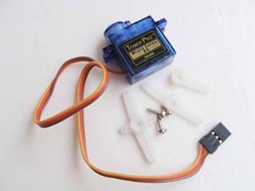

# BiaxialServo #

This is a library for controlling two servos(like Tower Pro SG90), this library depends on [Arduino Servo library](http://arduino.cc/en/Reference/Servo).

See the comprehensive usage on [WifiCar](https://github.com/elechouse/wifi-car) project.

## Instruction ##

### Files ###

- BiaxialServo.h - library header file
- BiaxialServo.cpp - library source file
- exmples - samples folder.
	- biaxial\_servo\_sample0.ino - sample
- image - some related images
- keywords.txt - ArduinoIDE brights the keywords in this file

### Functions ###
***BiaxialServo*** - library class name, use to declare a user class for using library.

***begin(int xy\_pin\_num, int yz\_pin\_num)*** - BiaxialServo initial function. Must be called in **setup() function** of arduino. xy\_pin\_num is the pin which is used to control xy direction servo, yz\_pin\_num is the pin which is used to control yz direction servo.

***up()*** - YZ servo up

***down()*** - YZ servo down

***left()*** - XY servo left

***right()*** - XY servo right

***center()*** - center two servos.

## How to ##

*This is a quick start guide, which aims to teach you how to use this **BiaxialServo** library and tell you what you need prepare for using.*

### Prepare ###

- [Arduino board](http://arduino.cc/en/Main/Products/)
- A biaxial servo bracket

	 

- two servos 

	 

### Connection ###

Connect servo with arduino. In the sample **Pin7(XY servo)** and **Pin8(YZ servo)** are used.

### Upload ###

1. Download BiaxialServo.

		#get through GIT tools :
		git clone https://github.com/elechouse/BiaxialServo.git

	or
		
		#download zip file
1. Extract the zip file if you download the zip format file. Copy BiaxialServo  to **$ArduinoSketch/libraries** .
		
	Note: **$ArduinoSketch** means your **Arduino sketchbook location**, you can find it by opening *ArduinoIDE->File->Preferences* manually or using shortcut **Ctrl+comma**
1. Reopen your Arduino IDE.
1. Open biaxial\_servo\_sample0. (ArduinoIDE->File->Examples->BiaxialServo->biaxial\_servo\_sample0)
1. Connect your [Arduino board](http://arduino.cc/en/Main/Products) to PC, select exact **Serial Port**, select exact arduino Board.
1. Hit **upload** button, wait to be uploaded.
1. Now you can control your **Servos** through serial port(_Default : 115200,8,N,1_),

### Control ###
Control your **Servos** by sending these characters:

- i --> up; 
- k --> down; 
- j --> left; 
- l --> right;
- o --> center; 

## **Buy** ##
[ ***Elechouse online shop*** ](http://www.elechouse.com).

